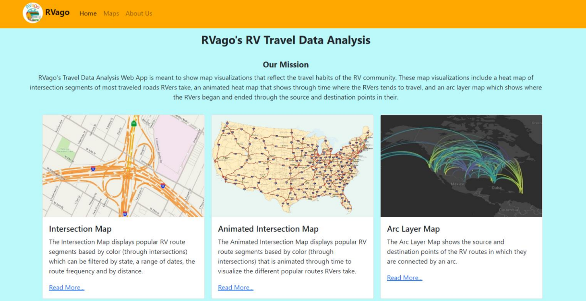

## Team RVago

### Who are we?
RVago is developed by the B.S. in Computer Science students Haroon Isse, Minh Tran, Mohammed Shihabeddin, Jackelyn Macias-Brijil, and Angelica Magnussen at the University of Texas at Arlington. RVago is an RV travel data analysis system. It intakes latitude and longitude data, creates map visualizations, and reflects the travel habits of the RV-ing community.

## Our Project

### Abstract
Recreational Vehicles are large motorhome vehicles that people use for road trips across the country. Generally, RVs are much larger and heavier than regular cars and cannot use typical GPS services such as Google Maps or Apple Maps because these services do not account for the dimensions and weight of a vehicle. Social Knowledge has created an RV trip planning service called RV Trip Wizard that allows users to get a safe and suitable route for their RV. This project will analyze historical data from RV Trip Wizard to identify RV traffic trends that can help new and existing users plan their trips better and provide safe conditions for users. Our team, RVago, will create a travel data analysis web app that will show map visualizations that reflect the travel habits of the RV community. These map visualizations include a heat map of intersection segments of most traveled roads RVers take, a heat map of the elevations of those traveled segments, and an animated heat map that shows through time where the RVers tend to travel.

### Project Poster
You can view the [Project Poster here](https://uta.engineering/innovationday/posters/2022/98.pdf)

### Project Video

<iframe src='https://www.youtube.com/embed/sfy39dSmKuk' frameborder='0' allowfullscreen></iframe>

  

### Thanks to Sponsor (Sponsor Accreditation)
We would like to convey our appreciation to Social Knowledge LLC for sponsoring our Senior Design project (CSE 4316-007 and CSE 4317-007), an undergraduate-program capstone project involving the analysis and design of an industry-type project. Social Knowledge has contributed to the development of this project by providing raw data and project guidance.
